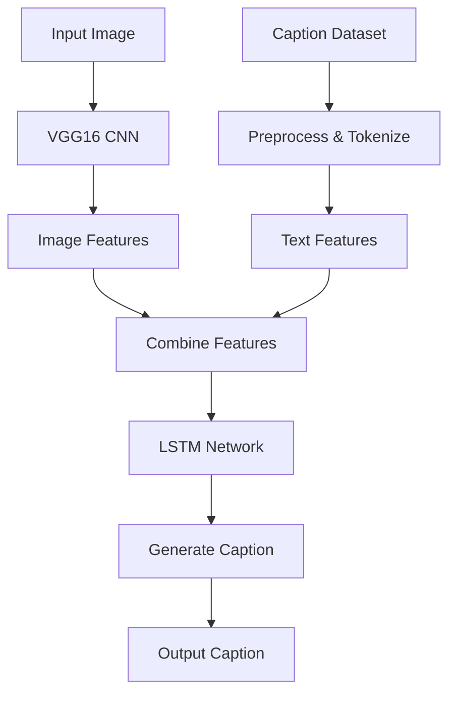

# Image Caption Generator using VGG16 CNN and LSTM

## Project Overview

This project implements an image caption generator using a combination of VGG16 Convolutional Neural Network (`CNN`) for image feature extraction and Long Short-Term Memory (`LSTM`) network for sequence generation. The model is trained on the `Flickr8k` dataset to generate descriptive captions for input images.

## Workflow


## Key Components

- `VGG16`: Used for extracting features from images
- `LSTM`: Used for generating sequential text based on image features
- `Keras`: The deep learning framework used for building and training the model
- `Flickr8k Dataset`: The dataset used for training and testing the model

## Setup and Installation
### Clone the repository
```
git clone https://github.com/eknathmali/Image-Caption-generator-using-VGG16-LSTM.git
cd Image-Caption-generator-using-VGG16-LSTM
```

### Install required packages
```
pip install -r requirements.txt
```

## Model Performance
The model's performance is evaluated using the BLEU score. After training, the current scores are (low score.. model can be improved 🙃):
```
BLEU-1: 0.110802
BLEU-2: 0.060709
```
## Improving Model Accuracy
### To increase the model's accuracy, consider the following:

1. `Increase the number of epochs:` The current model is trained for only 1 epoch. Increasing the number of epochs will allow the model to learn more from the dataset, potentially improving its performance.
2. `Use a high-performance machine:` Training this model on a GPU-enabled machine can significantly speed up the training process, allowing for more epochs and potentially better results.
3. `Data augmentation:` Implement data augmentation techniques to increase the diversity of the training data.
4. `Fine-tuning hyperparameters:` Experiment with different batch sizes, learning rates, and model architectures to optimize performance.
Use a larger dataset: Consider using a larger dataset like Flickr30k or MSCOCO for more diverse training data.

## Contact

[LinkedIn](https://www.linkedin.com/in/eknath-mali/ 'LinkedIn Profile')
